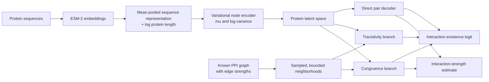

# PiPPINN

**An interpretable variational framework for protein–protein interaction prediction**

PiPPINN predicts whether two proteins interact and estimates the strength of that interaction by combining protein-language-model representations with explicit evidence from a known interaction network.

The framework is designed around a simple premise: a useful PPI model should do more than return a score. It should expose *why* an interaction is plausible. PiPPINN therefore keeps three sources of evidence separate until the final prediction:

- direct evidence learned from the two protein representations;
- transitivity evidence from similarity between their interaction neighborhoods; and
- congruence evidence from similarity to each other's known interaction partners.

> [!IMPORTANT]
> PiPPINN is research software under active development. The current repository captures the evolving model and optimization framework; a stable installation, command-line workflow, pretrained model, and benchmark release will be added when the project is ready for publication.

## Research objective

Protein interaction data are incomplete, unevenly sampled, and strongly biased toward well-studied proteins. At the same time, sequence similarity and network topology contain complementary information. PiPPINN explores how to combine these signals while retaining interpretable intermediate contributions and uncertainty-aware protein representations.

For a candidate pair of proteins `(u, v)`, the model produces:

1. an interaction-existence logit, converted to a probability with a sigmoid; and
2. a non-negative estimate of interaction strength or confidence.

The current implementation is an interpretable variational link predictor with a graph-aware decoder. It is not a conventional message-passing GNN: the node encoder operates on protein features, while graph context enters through explicitly constructed and sampled neighborhoods in the decoder.

## Framework at a glance



## Model architecture

### 1. Protein representations

Protein sequences are encoded with an ESM-2 model. The final-layer residue embeddings are averaged into one representation per protein, and a centered log-transformed protein-length feature is appended.

Sequences longer than the ESM-2 context window are divided into overlapping windows. Each window is encoded independently and the resulting window representations are averaged. The current encoder supports the 650M, 3B, and 15B ESM-2 variants.

These embeddings are treated as fixed input features during PiPPINN training.

### 2. Variational node encoder

An MLP maps each protein feature vector to the parameters of a diagonal Gaussian latent distribution:

```text
q(z | x) = Normal(mu(x), diag(exp(logvar(x))))
```

The log-variance is smoothly bounded for numerical stability. During training, latent vectors are sampled with the reparameterization trick; during evaluation, the posterior mean is used. A KL-divergence term regularizes the latent space toward a unit Gaussian prior.

This stage provides a compact, uncertainty-aware representation learned from the fixed ESM-derived features. Because the decoder also shapes this latent space through supervision, cosine similarity in the learned space should be interpreted as *task-adapted, homology-like similarity*, not as a direct measurement of biological homology.

### 3. Interpretable decoder

The decoder combines three complementary mechanisms.

#### Direct pair decoder

For proteins `u` and `v`, the model forms a symmetric pair representation from:

```text
z_u + z_v
z_u * z_v
```

Their concatenation is passed through an MLP with separate heads for interaction existence and interaction strength. This branch can learn nonlinear or complementary relationships that are not captured by explicit similarity rules.

#### Transitivity branch

The transitivity branch asks whether the neighborhoods of `u` and `v` occupy similar regions of the learned protein space.

It compares the latent representations of members of `N(u)` with members of `N(v)`, aggregates the pairwise cosine similarities with a log-sum-exp operation, and measures directed containment from the smaller neighborhood into the larger one. Equal-sized neighborhoods are handled symmetrically so the result is invariant to swapping the endpoints.

The resulting neighborhood score is passed through a learned monotone map, ensuring that stronger neighborhood similarity cannot reduce the branch's interaction-existence contribution.

#### Congruence branch

The congruence branch asks whether either candidate protein resembles a known partner of the other:

```text
u resembles a member of N(v), or
v resembles a member of N(u)
```

Attention over endpoint-to-neighbor cosine similarities focuses the branch on the most relevant supporting partners. The same attention pattern transfers known neighbor-edge strengths into a congruence-based strength estimate.

Learned monotone maps convert the aggregated evidence into:

- an interaction-existence contribution; and
- a non-negative interaction-strength contribution.

### 4. Prediction composition

Interaction existence is modeled as an additive logit:

```text
existence_logit = direct + transitivity + congruence
interaction_probability = sigmoid(existence_logit)
```

Interaction strength is also additive:

```text
interaction_strength = direct_strength + congruence_strength
```

The decoder can return each contribution separately, enabling per-edge inspection and branch-level ablation. These values are exact contributions under the current parameterization, although they should not yet be interpreted as statistically unique causal explanations: only their sum is supervised, so correlated branches may redistribute evidence between runs.

## Training framework

### Positive–unlabeled supervision

Known PPIs are treated as positive observations. Randomly sampled non-edges are unlabeled rather than guaranteed biological negatives.

The current training strategy assigns coverage-aware soft labels to sampled non-edges. Node degree acts as a proxy for how thoroughly a protein has been studied:

- missing edges between high-degree proteins receive harder, more negative labels;
- missing edges involving low-degree proteins receive softer labels because they are more likely to reflect incomplete coverage.

This is a pragmatic PU-learning approximation, not a full observation-propensity model. Replacing it with an explicit model of interaction truth and observation probability is part of the planned methodology.

### Edge minibatching and neighborhood control

PiPPINN separates positive edges used for supervision from positive edges used as neighborhood context within each minibatch, preventing the target edge from trivially appearing in its own evidence graph.

The sampler combines:

- uniform positive-edge sampling for broad graph coverage;
- centrality-weighted sampling to retain information around hubs;
- explicit tracking of previously unsampled edges; and
- random non-edge sampling for PU supervision.

Neighborhood size is capped to control memory and runtime. When a node has more neighbors than the configured limit, a compiled C++/OpenMP extension performs weighted sampling without replacement. Selection depends on relative endpoint degree, observed edge strength, and a tunable intensity parameter.

Similarity computation is chunked, uses reduced-precision normalized latents, and applies activation checkpointing during training to reduce memory pressure.

### Objective

The model is trained with a weighted sum of three losses:

```text
L = BCE_existence + lambda_strength * MSE_strength + beta_KL * KL
```

- binary cross-entropy supervises interaction existence using positive and coverage-aware soft labels;
- mean squared error supervises interaction strength on known positive edges only; and
- KL divergence regularizes the variational node representation.

The KL coefficient is warmed up during training. Hyperparameters are optimized with Optuna using a TPE sampler, Hyperband pruning, journal-backed storage, early stopping, and a validation score that combines loss with an ROC-AUC penalty.

## Data flow

The current repository follows this conceptual flow:

```text
tab-separated protein sequences
        |
        v
ESM-2 protein embeddings + length feature
        |
        v
PyTorch Geometric graph from a weighted PPI edge list
        |
        v
train/validation graph split + sampled non-edges
        |
        v
edge minibatches with bounded neighborhood context
        |
        v
variational encoding + interpretable edge decoding
        |
        v
interaction probability, strength, and branch contributions
```

The graph representation uses:

- `x`: protein feature matrix;
- `edge_index`: known protein pairs;
- `edge_attr`: normalized interaction strengths; and
- `node_degree`: graph degree used by the sampling and coverage heuristics.

## Repository map

| File | Role |
| --- | --- |
| `GVAE_model.py` | Variational node encoder, monotone evidence maps, interpretable decoder, and training loss |
| `TrainUtils.py` | Graph splitting, negative sampling, PU labels, edge minibatching, neighborhood construction, and schedulers |
| `Neighborhood_restriction.cpp` | Weighted, bounded neighborhood sampling implemented as a PyTorch C++ extension |
| `EncodeProteins.py` | ESM-2 sequence encoding, including long-sequence windowing and the protein-length feature |
| `Generate_PyG_Graph_Data.py` | Conversion of embeddings and weighted edge lists into PyTorch Geometric graphs |
| `OptimizeHyperparams.py` | Optuna-based hyperparameter search for the current variational model |

`Retrain.py`, `Evaluate_Trained.py`, and `HPO_stage2.py` currently reflect earlier or unfinished workflows and are being brought into alignment with the variational framework.

## Interpretation and scope

PiPPINN is intended to support questions such as:

- Is a prediction driven mainly by the protein pair itself or by network context?
- Which known interaction partners provide congruence evidence?
- Does the model find one neighborhood approximately contained within another?
- How does incomplete graph coverage affect the treatment of an absent edge?
- How stable are the prediction and its evidence components across latent samples, graph samples, and training runs?

Several boundaries are important:

- A high predicted score is a model hypothesis, not experimental confirmation.
- Absence from a PPI database does not establish non-interaction.
- Degree is only a proxy for experimental coverage and can also reflect real biology.
- Truncated or sparsely observed neighborhoods provide less reliable graph evidence.
- Additive decoder contributions are inspectable but are not yet statistically identifiable explanations.

## Installation and usage

Detailed installation and end-to-end usage documentation are intentionally deferred until the training and release workflow is stable.

At present, the framework is built around Python, PyTorch, PyTorch Geometric, ESM-2, Optuna, and a small C++/OpenMP PyTorch extension. The main workflow stages are sequence encoding, graph construction, dataset preparation, hyperparameter optimization, retraining, and evaluation.

## License

See [LICENSE](LICENSE).
